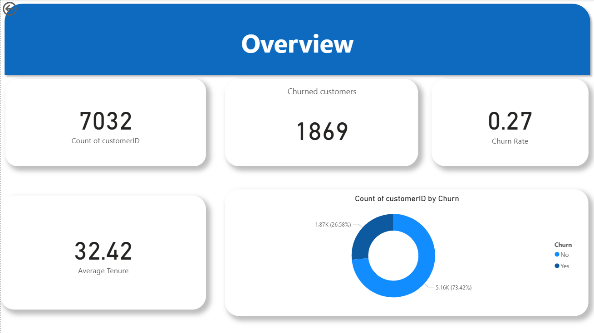
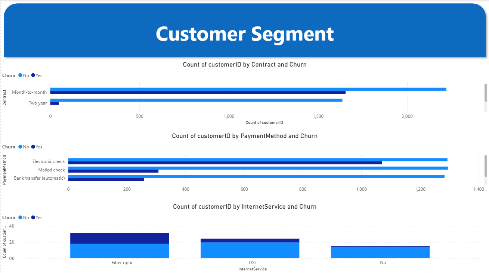

# Telco Customer Churn – Data Analysis (Python + Power BI)

## Overview
This project analyzes telecom customer churn to understand who leaves and why, and to suggest retention actions. It includes Python-based data cleaning and exploratory analysis, plus a Power BI dashboard for stakeholder-friendly insights.

## Dataset
- ~7,000 customer records (Telco churn sample)
- Key fields: tenure, MonthlyCharges, TotalCharges, Contract, PaymentMethod, InternetService, demographics
- Target: `Churn` (Yes/No)

## What’s in this repo
- `notebooks/Customer_Churn_Analysis.ipynb` – data cleaning, EDA, visual summaries
- `data/cleaned_telco_churn_bi.csv` – BI-friendly cleaned dataset (categoricals intact)
- `powerbi/Churn_Dashboard.pbix` – Power BI report (two pages: Overview & Segments)
- `images/` – dashboard screenshots for quick preview

## Key Insights (from EDA)
- Churn rate is highest for **Month-to-month** contracts.
- **Electronic Check** users churn more than other payment methods.
- Lack of **Online Security / Tech Support / Backup** correlates with higher churn.
- Newer customers (low tenure, low TotalCharges) churn more.
- Long-term contracts and automatic payments reduce churn risk.

## Recommendations
1. Incentivize migration from month-to-month to annual contracts.
2. Promote auto-pay options to reduce Electronic Check usage.
3. Bundle/support add-ons (security, tech support, backup) for at-risk segments.
4. Target onboarding/loyalty programs to customers in their first 6 months.

## Power BI Dashboard (Previews)

## How to run (Python)
1. Open `notebooks/Customer_Churn_Analysis.ipynb` in Jupyter/Colab.
2. Ensure `data/cleaned_telco_churn_bi.csv` is available for visual checks or export from the notebook if needed.

## Tech Stack
Python (Pandas, Matplotlib/Seaborn), Power BI.

## License
MIT
